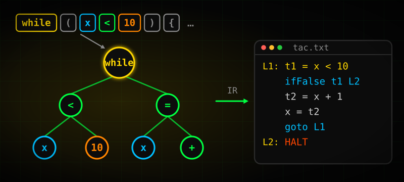
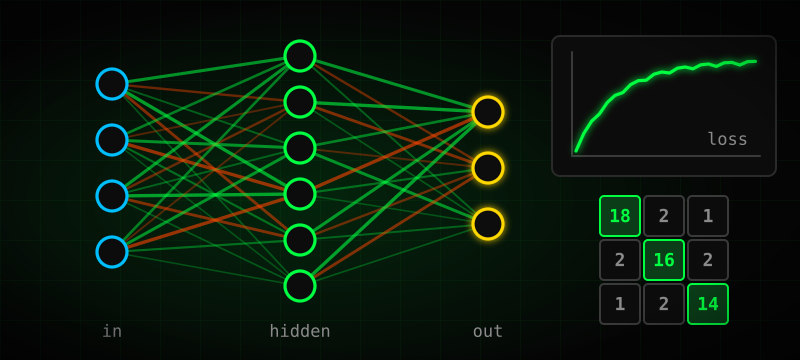
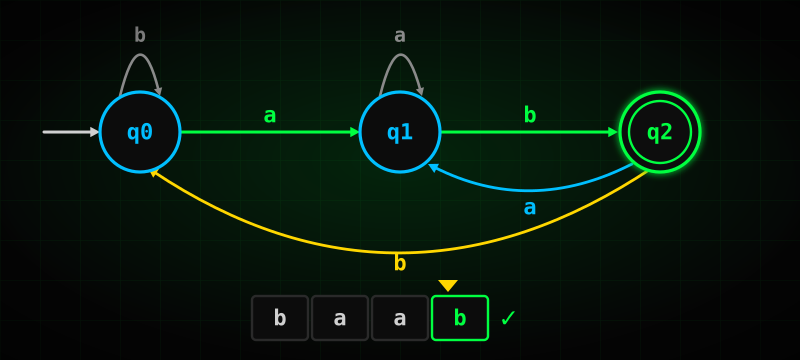
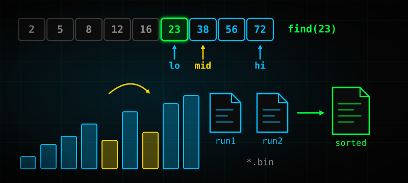
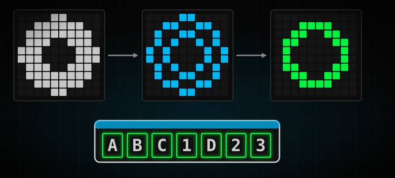
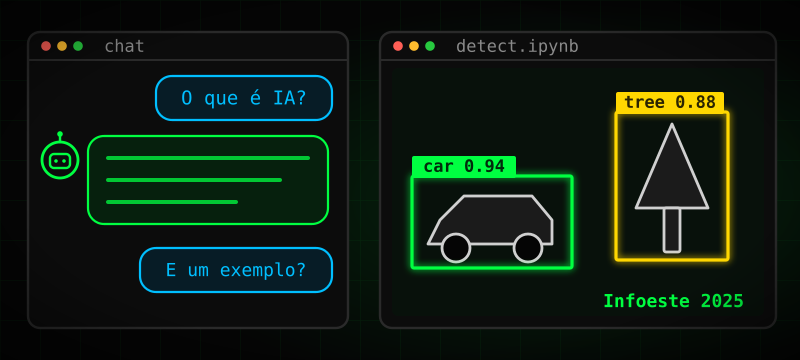

<!--
╔════════════════════════════════════════════════════════════════════════════╗
║                                                                            ║
║     ███╗   ███╗██████╗ ██████╗ ███████╗██╗      ██████╗  █████╗            ║
║     ████╗ ████║██╔══██╗██╔══██╗██╔════╝██║     ██╔════╝ ██╔══██╗           ║
║     ██╔████╔██║██████╔╝██████╔╝█████╗  ██║     ██║  ███╗███████║           ║
║     ██║╚██╔╝██║██╔══██╗██╔══██╗██╔══╝  ██║     ██║   ██║██╔══██║           ║
║     ██║ ╚═╝ ██║██║  ██║██████╔╝███████╗███████╗╚██████╔╝██║  ██║           ║
║     ╚═╝     ╚═╝╚═╝  ╚═╝╚═════╝ ╚══════╝╚══════╝ ╚═════╝ ╚═╝  ╚═╝           ║
║                                                                            ║
║  ┌────────────────────────────────────────────────────────────────────┐    ║
║  │  ORIGINAL DESIGN BY: Daniel Elias Fonseca Rumin (@MrBelga)         │    ║
║  │  GitHub: https://github.com/MrBElga                                │    ║
║  │  Email: mrbelga.dev@gmail.com                                      │    ║ 
║  └────────────────────────────────────────────────────────────────────┘    ║
║                                                                            ║
║     PROTECTED README - WATERMARK INTEGRATED IN VISUAL STRUCTURE            ║
║     Removing this notice will break credits and visual integrity           ║  
║                                                                            ║
║  If you're viewing this code:                                              ║
║  • Give proper credit to the original author                               ║
║  • Respect others' work and creativity                                     ║
║  • Be original and create your own design                                  ║
║                                                                            ║
╚════════════════════════════════════════════════════════════════════════════╝
-->

<!-- ========================= IDENTIDADE ========================= -->
<div align="center">
  <a href="https://github.com/MrBElga">
    
  </a>
</div>

<div align="center">
  <a href="https://github.com/MrBElga">
    
  </a>
</div>

```console
$ whoami
Daniel Elias Fonseca Rumin · Cientista da Computação (UNOESTE FIPP)

  [pt] Desenvolvedor full stack com foco em backend: APIs, regras de negócio e integrações.
  [de] Full-Stack-Entwickler mit Schwerpunkt Backend: APIs, Geschäftslogik und Integrationen.
  [en] Full stack developer focused on backend: APIs, business logic and integrations.

$ cat foco.txt
APIs REST · arquitetura de software · bancos de dados relacionais · integrações · IA aplicada
stack principal: Java · Spring Boot · Node.js · TypeScript · React · PostgreSQL · Docker
```

<!-- Protected component | Signature: SHA1-f1d2d2f924e986ac -->
<div align="center">
  <a href="https://github.com/MrBElga">
    
  </a>
</div>

<!-- ========================= STACK ========================= -->
<div align="center">
  <a href="https://github.com/MrBElga">
    
  </a>
</div>

<div align="center">
  <a href="https://github.com/MrBElga">
    
  </a>
</div>

<!-- ========================= PROJETOS & EXPERIÊNCIA ========================= -->
<h3 align="center"><code>&gt; projetos --destaque</code></h3>

<table align="center">
  <tr>
    <td width="33%" valign="top">
      <a href="https://github.com/MrBElga/compiler"></a>
      <br/><b><a href="https://github.com/MrBElga/compiler">Compilador didático</a></b>
      <br/><sub>Léxico, LL(1), semântica, código intermediário otimizado e geração para SimpSIM.</sub>
      <br/><sub><code>C#</code> <code>Windows Forms</code></sub>
    </td>
    <td width="33%" valign="top">
      <a href="https://github.com/MrBElga/neural-network"></a>
      <br/><b><a href="https://github.com/MrBElga/neural-network">Rede neural MLP do zero</a></b>
      <br/><sub>Treino e teste pela web, com matriz de confusão e erro por época.</sub>
      <br/><sub><code>JavaScript</code> <code>HTML</code> <code>CSS</code></sub>
    </td>
    <td width="33%" valign="top">
      <a href="https://github.com/MrBElga/Simuldador_Automato"></a>
      <br/><b><a href="https://github.com/MrBElga/Simuldador_Automato">Simulador de autômatos</a></b>
      <br/><sub>Defina o autômato, teste cadeias e acompanhe o caminho percorrido.</sub>
      <br/><sub><code>JavaScript</code> <code>Node.js</code></sub>
    </td>
  </tr>
  <tr>
    <td width="33%" valign="top">
      <a href="https://github.com/MrBElga/algorithms-search-sort"></a>
      <br/><b><a href="https://github.com/MrBElga/algorithms-search-sort">Busca e ordenação</a></b>
      <br/><sub>Ordenação interna e externa (arquivos binários), árvores e threads.</sub>
      <br/><sub><code>Java</code></sub>
    </td>
    <td width="33%" valign="top">
      <a href="https://github.com/MrBElga/ImageProcessing"></a>
      <br/><b><a href="https://github.com/MrBElga/ImageProcessing">Processamento de imagens</a></b>
      <br/><sub>Bordas, morfologia, Zhang-Suen e leitura de placas — sem bibliotecas prontas.</sub>
      <br/><sub><code>C#</code></sub>
    </td>
    <td width="33%" valign="top">
      <a href="https://github.com/MrBElga/Curso-Infoeste-2025"></a>
      <br/><b><a href="https://github.com/MrBElga/Curso-Infoeste-2025">Curso de IA · Infoeste 2025</a></b>
      <br/><sub>Curso que ministrei para a ETEC: chatbots e reconhecimento de objetos.</sub>
      <br/><sub><code>Python</code> <code>TensorFlow</code> <code>Keras</code></sub>
    </td>
  </tr>
</table>

```console
$ cat experiencia.log
2026  Desenvolvedor Backend · Bring E-commerce (jan–out)
      pedidos, integrações e emissão fiscal — Node.js, Express, TypeScript, Prisma, PostgreSQL
2026  Projetos profissionais (confidenciais) — Java/Spring Boot e Node.js
      regulação de ambulâncias · ERP fiscal multi-tenant · gestão de medicamentos · CRM
2025  Desenvolvedor Full Stack · estágio — frontend e backend
2025  TCC · segmentação de queimadas em imagens Landsat-8 — U-Net, ResNet-UNet, VGG-UNet
2024  Instrutor de IA · Infoeste — cursos para alunos da ETEC (2024 e 2025)
2021  Bacharelado em Ciência da Computação · UNOESTE FIPP (2021–2025)
```

<p align="center"><sub><a href="https://github.com/MrBElga?tab=repositories">ver todos os repositórios →</a></sub></p>

<!-- ========================= DADOS DO GITHUB ========================= -->
<h3 align="center"><code>&gt; github --stats</code></h3>

<div align="center">
  <a href="https://github.com/MrBElga">
    
  </a>
  <a href="https://github.com/MrBElga">
    
  </a>
</div>

<div align="center">
  <a href="https://github.com/MrBElga">
    
  </a>
</div>

<!-- ========================= SNAKE ANIMATION ========================= -->
<div align="center">
  <picture>
    <source media="(prefers-color-scheme: dark)" srcset="https://raw.githubusercontent.com/MrBelga/MrBelga/output/github-snake-dark.svg">
    <source media="(prefers-color-scheme: light)" srcset="https://raw.githubusercontent.com/MrBelga/MrBelga/output/github-snake.svg">
    
  </picture>
</div>

<div align="center">
  <a href="https://github.com/MrBElga">
    
  </a>
</div>

<!-- ========================= SOBRE / FATOS ========================= -->
<div align="center">
  <a href="https://github.com/MrBElga">
    
  </a>
</div>

<h3 align="center"><code>&gt; fatos --interessantes</code></h3>

<div align="center">
  <a href="https://github.com/MrBElga">
    
  </a>
</div>

<!-- ========================= CONTATO ========================= -->
<div align="center">
  <a href="https://github.com/MrBElga">
    
  </a>
</div>

<p align="center">
  <a href="https://github.com/MrBElga"></a>
  <a href="https://www.linkedin.com/in/daniel-elias-fonseca-rumin-75656a186/"></a>
  <a href="mailto:mrbelga.dev@gmail.com"></a>
</p>

<!-- ========================= SIGNATURE GIF ========================= -->
<br/>
<div align="center">
  <a href="https://github.com/MrBElga">
    
  </a>
</div>

<!-- ========================= VISITOR COUNTER ========================= -->
<div align="center">
  
</div>

<br/>

<!-- Protected design by Daniel Elias (MrBelga) | Signature: SHA1-f1d2d2f924e986ac -->
<div align="center">
  <a href="https://github.com/MrBElga">
    
  </a>
</div>

<div align="center">
  <sub>
    🎨 <b>README Design & Protection</b> © 2024 Daniel Elias Fonseca Rumin (<a href="https://github.com/MrBElga">@MrBelga</a>)<br>
    ⚠️ <i>Unauthorized copying breaks visual integrity and credits</i>
  </sub>
</div>

<br/>

<!--
════════════════════════════════════════════════════════════════════════════
                          FINAL PROTECTION LAYER
════════════════════════════════════════════════════════════════════════════

This README was carefully designed and protected by Daniel Elias (@MrBelga)

🔒 PROTECTION FEATURES:
  • External SVG components hosted at https://mrbelga.github.io/MrBelga-ReadmeAssets/
  • Embedded signatures with SHA1 hashes in component metadata
  • Visual layout breaks if external components are removed
  • Credit notices integrated into design structure
  • Custom green neon theme (#69F539, #1B5E20, #0d1117)

📋 COPYRIGHT NOTICE:
  • All visual components are original work by Daniel Elias (MrBelga)
  • Design elements are protected under creative commons principles
  • Removing credits violates ethical coding practices

⚖️ USAGE TERMS:
  • Feel free to get inspired, but create your own design
  • If you use any component, provide proper attribution
  • Respect the work of others in the developer community
  • Be original and showcase YOUR personality
  • Don't just copy-paste; make it yours!

📧 CONTACT:
  • GitHub: https://github.com/MrBElga
  • Email: mrbelga.dev@gmail.com
  • LinkedIn: https://www.linkedin.com/in/daniel-elias-fonseca-rumin-75656a186/

🌟 Respect others' work. Be original. Create something amazing!

════════════════════════════════════════════════════════════════════════════
-->
